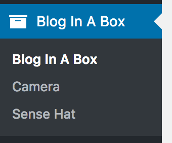
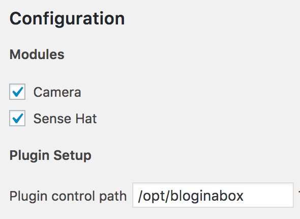

# Blog In A Box WordPress Plugin

A custom WordPress plugin for Blog In A Box.

Provides an admin interface to the [Blog In A Box device handler tool](https://github.com/Automattic/biab-cli), as well as widgets for SenseHAT readings.

## Installation

The plugin is installed as a standard WordPress plugin by copying to `wp-content/plugins`.

Note: this is done automatically when using [Blog In A Box Installer](https://github.com/Automattic/biab-installer).

## Usage

Once installed the plugin appears as a menu in the WordPress admin interface:



The main admin page allows individual device modules to be enable or disabled:



The plugin control path should point to the [Blog In A Box CLI](https://github.com/Automattic/biab-cli) tools.

## Camera Module

With a Raspberry Pi camera attached you can use the camera module. This allows you to take photos (manually or scheduled) and have them appear as blog posts.

### Manual Photo

Press the `take photo` button to take an immediate photo. A small window appears with the photo.

### Scheduled Photo

Set an interval (seconds, minutes, or hours) to have the camera automatically take a photo and add it to a new blog post. This is perfect for taking snapshots of a particular location!

### Settings

You can change various camera settings:

- Vertical / horizontal flip - this may be needed depending on the orientation of the camera
- Quality - the JPEG quality of the photos (from 1% to 100%), which determines the file size
- Brightness / saturation / sharpness / contrast
- ISO - adjusts the camera's ISO setting. A higher ISO allows more light onto the sensor, but increases noise.
- White balance - adjust according to the light colour
- Effect - add a special effect to the captured photo

## SenseHAT Module

With an attached SenseHAT module you can monitor environment data (temperature, humidity, and air pressure) and have this displayed on your blog either as a live display, or a historical chart. Additionally you can use the SenseHAT display to show readings.

### Manual Reading

Press the `publish report` button to take an immediate reading and publish this as a blog post.

### Scheduled Reading

Set an interval (seconds, minutes, or hours) to have readings automatically taken. These will be stored, but not result in a blog post.

### Units

Change the temperature units between Celsius and Fahrenheit.

## Developing

The plugin is designed to be extended with additional devices, and should match changes in the [CLI tool](https://github.com/Automattic/biab-cli).

Each device module is effectively a WordPress plugin in its own right, and has full access to all WordPress plugin hooks.

To add an additional device:

- Create a device directory
- Create a standard WordPress plugin entry point for the device - see `camera/camera.php` as an example
- Include the entry point at the bottom of `blog-in-a-box.php`

Your device can now perform whatever WordPress functions are necessary.

### Interfacing with Blog In A Box CLI

At some point your WordPress device code will need to talk to the associated CLI device code. This is achieved by extending the `BiabControl` class:

```php
class BiabOtherDevice extends BiabControl {
	public function do_special_thing( $data ) {
		$this->request( 'my-cli-command', $data );
	}
}
```

This will call the `my-cli-command` from the Blog In A Box CLI tool. Effectively:

`biab my-cli-command data`

If the command returns data you can listen to this with:

```php
$response = $this->request( 'my-cli-command', $data );
```

Where `$response` will contain:

```php
array(
	'retval' => 0,
	'output' => 'your returned data'
);
```

The `retval` is the exit code from the CLI tool. Anything other than `0` is an error.

## Contributing

We welcome contributions in any form, and you can help reporting, testing, and detailing bugs.

## License

The Blog In A Box theme is licensed under [GNU General Public License v2 (or later)](./LICENSE.md).
